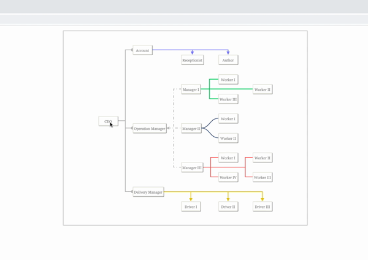

[](https://travis-ci.org/AhmedAlatawi/ngx-treant-js)
[](http://commitizen.github.io/cz-cli/)
[](https://github.com/semantic-release/semantic-release)
[](https://renovatebot.com/)


# NgxTreantJS :deciduous_tree:



A simple Angular2+ component used as a wrapper for [TreantJS](https://fperucic.github.io/treant-js/) library for visualization of tree (chart) diagrams, with additional functionality. :fire::fire::fire:

### :arrow_down: Installation 
```sh
npm install @ahmed757/ngx-treant-js --save
```

### Quick start :rocket:
`employess-chart.component.html`
```html
<ngx-treant-chart
    [chartId]="employeesChartId"
    [chartClass]="employeesChartClass"
    [data]="employeesData">
</ngx-treant-chart>
```

`employess-chart.component.ts`
```typescript
export class EmployeesChartComponent {
    employeesChartId = 'employessChart-commpany';
    employeesChartClass = 'employess-chart';

    employeesData = {
        chart: {
            // must match the String value for `chartId`
            container: '#employessChart-commpany',

            levelSeparation: 45,

            rootOrientation: 'WEST',

            nodeAlign: 'BOTTOM',

            connectors: {
                type: 'step',
                style: {
                    'stroke-width': 2
                }
            },
            node: {
                HTMLclass: 'product-commpany'
            }
        },

        nodeStructure: {
            text: { name: 'CEO' },
            connectors: {
                style: {
                    stroke: '#bbb',
                    'arrow-end': 'oval-wide-long'
                }
            },
            children: [{
                    text: { name: 'Account' },
                    stackChildren: true,
                    connectors: {
                        style: {
                            stroke: '#8080FF',
                            'arrow-end': 'block-wide-long'
                        }
                    },
                    children: [{
                            text: { name: 'Receptionist' },
                            HTMLclass: 'reception'
                        },
                        {
                            text: { name: 'Author' }
                        }
                    ]
                },
                {
                    text: { name: 'Operation Manager' },
                    connectors: {
                        style: {
                            stroke: '#bbb',
                            'stroke-dasharray': '- .',
                            'arrow-start': 'classic-wide-long'
                        }
                    },
                    children: [...]
                }
            ]
        }
    }
}
```

`styles.css`
```css
...
/* class name must match the String value for `chartClass` */
.employess-chart {
  height: 600px;
  width: 750px;
  margin: 5px;
  margin: 15px auto;
  border: 3px solid #DDD;
  border-radius: 3px;
}

.node {
  font-size: 11px;
}

.node.product-commpany {
  cursor: pointer;
  padding: 0 2px;
  min-width: 60px;
  text-align: center;
  height: 30px;
  border: 2px solid #E8E8E3;
  border-radius: 2px;
  box-shadow: 1px 1px 1px rgba(0, 0, 0, .5);
  background: #fff;
}
...
```
See full example [here](https://github.com/fperucic/treant-js/tree/master/examples/connectors).

**Note: :bulb:** In a real world application, the `data` would most likely come from a server or remote place, which means that we would need to initialize `NgxTreantChart` only when `data` arrives. Therefore, `*ngIf` can be used as a workaround as follows:
```html
<ngx-treant-chart
    ...

    *ngIf="isDataLoaded">
</ngx-treant-chart>
```


### :page_facing_up: NgxTreantChart component API

| Attributes | Description |
| --- | --- |
| `[chartId]` | The chart uniqe `ID` (required) | 
| `[chartClass]` | The chart `CSS` class uniqe name (optional) |
| `[data]` | The data used for visualization of chart diagrams (required) |
| `[popoverSettings]` | The settings used for customizing a `popover` (optional - see [example]()) |
| `[mouseleaveMilliseconds]` | The mouseleaveMilliseconds delay used prior to a `popover` being hidden (optional) |
| `[isDraggable]` | A `boolean` flag used to enable `drag` & `drop` support (optional) |
| `(clicked)` | A callback function invoked when a `TreeNode` is clicked |
| `(hovered)` | A callback function invoked when a `TreeNode` is mouse hovered |
| `(dragged)` | A callback function invoked when a `TreeNode` is dragged |
| `(dropped)` | A callback function invoked when a `TreeNode` is dropped |
| `(updated)` | A callback function invoked when `TreeNode`'s content is updated |
| `(loadedNodes)` | A callback function invoked when `TreeNodes` are loaded |
| `(loadedTree)` | A callback function invoked when the `Tree` is loaded |
| `(loadedTreant)` | A callback function invoked when the `Treant` is loaded |

### Notes: :bulb:

1. The callback functions: `clicked`, `hovered`, and `updated` return a value of `Object` type, which consists of two properties:

* `Node`: instance of `TreeNode` type for the node that was modified
* `$`: `jQuery` instance, which can be used to perform any additional desired functionality that requires `jQuery`

### Example :pushpin:

```html
<ngx-treant-chart
    ...

    (clicked)="onClick($event)">
</ngx-treant-chart>
```
```typescript
onClick(event: any): void {
/* 
event: {
  node: {
    X: 106
    Y: 259.5
    children: (3) [1, 4, 19]
    collapsable: undefined
    collapsed: undefined
    connStyle: {type: "step", style: {…}, 
    stackIndent: 15}
    drawLineThrough: undefined
    height: 30
    id: 0
    image: undefined,
    ...
  },

  $: ƒ (e,t)
}
*/
}
```

2. The callback function `dragged` returns an object which contains an instance of `TreeNode` type as well as `jQuery` as follows:
```typescript
{
    draggedNode: {
        X: 106
        Y: 259.5
        children: (3) [1, 4, 19]
        collapsable: undefined,
        ...
    },

    $: ƒ (e,t)
}
```

3. The callback function `dropped` returns the following:
* `draggedNode`: the dragged node of `TreeNode` type
* `droppedNode`: the dropped node of `TreeNode` type
* `$`: `jQuery` instance

4. The callback function `loadedNodes` returns all `Tree` (chart) nodes.

5. The callback function `loadedTree` returns an instance of `Tree` (chart) type. The instance provides useful properties and functions, such as `nodeDB` and `positionTree()`, which can be used to update tree (chart) nodes:

```typescript
...

onLoadTree(tree: any): void {
    const nodes = tree.nodeDB;

    // do something with nodes

    tree.positionTree(); // apply changes
}
```

6. The callback function `loadedTreant` returns an instance of `Treant` type. The instance consists of `container_id` and `tree_id`:

```typescript
...

onLoadTreant(treant: any): void {
    console.log(treant);
    /* example
      {
        container_id: "employessChart-commpany",
        tree_id: 0
      }
    */

    treant.destroy(); // destroy tree
}
```


### Reference :dart:
* [TreantJS](https://fperucic.github.io/treant-js/)


### Author :books:
[Ahmed Alatawi](https://github.com/AhmedAlatawi)

